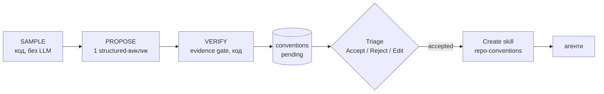

# Conventions Extractor

Skills Lab → **Conventions**: знаходить домовленості, яких код репозиторію вже
дотримується, дає їх затріажити і збирає прийняті в скіл, який агент-рев'юер
застосовує до кожного PR.

План і хід робіт: [conventions-extractor-plan.md](conventions-extractor-plan.md).

## Як це працює

| Стадія | Де | Що робить |
|---|---|---|
| **SAMPLE** | `modules/conventions/sampling.ts` | `repoIntel.getConventionSamples()` → ранжований пул → **стратифікація** (round-robin між пакетами, всередині пакета між теками, без `.claude/`, `.github/`) → 12 файлів. Конфіги (`tsconfig`, eslint, prettier, `.editorconfig`, `biome.json`, `package.json`) у корені й кожному пакеті, по черзі. Кожен файл обрізається, отримує нумерацію рядків і обгортку `<untrusted>` |
| **PROPOSE** | `service.ts`, `src/prompts/conventions.system.md` | Модель фічі `conventions` (Settings → Models). Схема: `{rule, evidence{file, line_start, line_end, snippet}, category, confidence}`. Порядок полів — порядок генерації: спершу правило й доказ, потім оцінка |
| **VERIFY** | `evidence.ts` | Файл ∈ вибірки (тож прочитати поза нею не можна) → кожен рядок сніпета мусить по черзі знайтися в непорожніх рядках файлу (без урахування пробілів, скопійований гаттер ігнорується) → найближчий до вказаних рядків збіг, номери виправляються → сніпет **вирізається з файлу**. Вигадане чи тривіальне відкидається |
| **Persist** | `repository.ts` | Транзакція + `advisoryXactLock(conventions:<repoId>)`: re-scan видаляє лише `pending`; уже прийняті чи відхилені правила (за нормалізованим текстом) не пропонуються знову. Рядок `convention_scans` зберігає вибірку, модель, вартість, `proposed / dropped / skipped` |
| **Skill** | `skill-body.ts` | Прийняті правила згруповані за категоріями, кожне з `Evidence: file:line` і кодом. Огорожа блоку коду довша за будь-яку послідовність бектиків у сніпеті. `repo-conventions` створюється або отримує нову версію; прив'язка пропускає агентів, які вже мають скіл, щоб не зламати порядок у промпті |

API: `GET /repos/:id/conventions`, `POST …/extract` (5 запитів на хвилину),
`PATCH /conventions/:id`, `POST …/skill-draft`, `POST …/skill`.

## Безпека

- **Код репозиторію — недовірений вхід.** Файли йдуть у промпт у `<untrusted>`,
  а тіло скіла, зібране з evidence, проходить `platform/prompt-injection.ts`
  ще до запису: коментар «ignore previous instructions» у коді не потрапить у
  промпт агента.
- **Evidence не може вийти за вибірку.** Шлях, який назвала модель, має бути
  серед показаних файлів, інакше кандидат відкидається.
- **Скіли з injection** (див. `server/AGENTS.md` → Gotchas): зберігаються
  вимкненими, не прив'язуються, пропускаються при збиранні промпту. Це перевірка
  довіреної межі, не гарантія безпеки.
- **Імпорт з URL**: лише https; кожна адреса DNS і кожен redirect перевіряються
  на приватність (`platform/url-safety.ts`); з'єднання йде на перевірену адресу.

## Що показав реальний скан (dev-digest, gpt-5.4)

| Скан | Вибірка | Результат | Вартість |
|---|---|---|---|
| 1 | топ-12 за рангом: 11 файлів з `server/src/platform/` | 12 правил, 0 відкинуто, усі про сервер | $0.049 |
| 2 | стратифікована, але граф імпортів був порожній (усі ранги рівні) | 12 правил, лише про `client/` | $0.048 |

Висновки: (1) перевірка evidence проходить майже все, бо модель цитує з
пронумерованих рядків, тож цінність гейту в тому, що він гарантує справжність
сніпета, а не в кількості відкинутого; (2) якість знахідок визначає **вибірка**,
а не промпт: якщо «топ» зсунутий в одну підсистему, правила стосуються лише її.
Порожній граф був окремим багом repo-intel (Windows-шляхи в depgraph),
тепер виправленим; ранги знову різні.

## Продуктові покращення

Що дасть **більше** знахідок і **кращої якості**, у порядку користь/вартість.

1. **✅ Стратифікована вибірка** (зроблено). Рівна частка для кожного пакета й
   теки, приховані теки виключені. Без неї правила однієї підсистеми видаються
   за правила всього репо.
2. **Підтримка замість самооцінки.** `confidence` від моделі — не міра: вона
   «впевнена» однаково в усьому. Замість неї варто рахувати кодом, у скількох
   файлах пакета правило справджується. Модель повертає разом із правилом
   перевірний патерн (regex / ast-grep), і ми показуємо «11 / 14 файлів» і
   сортуємо за цим числом. Правило з 2 / 14 — не конвенція.
3. **Контрприклади.** Той самий патерн, прогнаний по всьому репо, знаходить
   місця, які правило порушують. Це одразу і фільтр («порушень більше, ніж
   дотримань» — відкинути), і цінність для людини (перелік місць на рефакторинг).
4. **Детерміновані правила з конфігів.** `strict: true`, `noUncheckedIndexedAccess`,
   eslint-правила з рівнем `error`, prettier — це правила зі 100% підтримкою,
   які не потребують LLM. Витягати їх парсером, показувати з позначкою
   «enforced by config» і не витрачати на них токени моделі.
5. **Кілька доказів на правило.** Один сніпет легко виявляється винятком.
   Два-три докази з різних файлів роблять картку переконливою і дають агентові
   кращі приклади «добре».
6. **Сигнал з історії рев'ю.** Findings, які команда приймає (accepted), і
   ті, які відхиляє (dismissed), — найкраща підказка, що реально вимагається.
   Кластеризувати прийняті findings за темою й пропонувати їх як кандидатів у
   конвенції, навіть якщо в коді вони ще не всюди дотримані.
7. **Інкрементальний скан.** Після мерджу PR, що змінює конфіги або додає нову
   теку, сканувати лише зачеплені пакети й пропонувати **оновлення** правил
   (правило, яке перестало справджуватися, позначати як «застаріле»).
8. **Кілька скілів замість одного.** Групувати прийняті правила за пакетом або
   категорією (`client-conventions`, `server-error-handling`) і прив'язувати
   кожен до відповідного агента: менше шуму в промпті, кожне правило ближче до
   місця, де воно має сенс.
9. **Експорт у Claude Code.** Прийняті правила в тому самому форматі — як
   `SKILL.md` у плагіні (`plugin.json` + `marketplace.json`), щоб їх
   застосовував і Claude Code в IDE, а не лише рев'юер у DevDigest.
